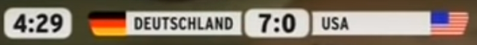

# Autoball (Car-Soccer)

This should not just be a <a href="https://www.rocketleague.com/">Rocket League</a> clone, but an adaption of the "Autoball" series from <a href="https://www.prosieben.de/serien/tv-total">TV-Total</a>.
It should contain realistic car physics and the same rules, as in the TV show.

<details>
    <summary>To get an overview about the Show and a few matches, here are some usefully links</summary>
    
https://en.wikipedia.org/wiki/Autoball
<br>https://de.wikipedia.org/wiki/Autoball
<br>https://www.youtube.com/watch?v=FU5GgSzf5-k&pp=ygUIYXV0b2JhbGw%3D
<br>https://www.youtube.com/watch?v=QmUz5YJ9bdk&pp=ygUIYXV0b2JhbGw%3D
<br>https://www.youtube.com/watch?v=qf_L2ue9xCI&pp=ygUIYXV0b2JhbGw%3D
</details>

The cars that are used in the Series from TV-Total where:
<br>2008: <a href="https://en.wikipedia.org/wiki/VW_Fox">VW Fox</a>
<br>2010-2014: <a href="https://en.wikipedia.org/wiki/VW_Polo">VW Polo</a>
<br>2022: <a href="https://en.wikipedia.org/wiki/Opel_Corsa_C">Open Corsa C</a>

## Timer and Scores

The original Timer design from the 2010-2014 seasons looked like:

<br>I tried to replicate it and not it looks a bit like this:

<details>
    <summary>The SVG code for the image</summary>

```svg
<svg width="1257" height="90" viewBox="0 0 1257 90" fill="none" xmlns="http://www.w3.org/2000/svg">
    <rect width="190" height="90" rx="28" fill="white"/>
    <rect x="652" y="3" width="181" height="85" rx="28" fill="white"/>
    <rect x="333" y="10" width="306" height="70" fill="white"/>
    <path d="M333 80V10H242.664C230.149 10 227.693 22.4221 228.029 28.6331C228.029 69.3237 244.515 79.8321 252.758 80H333Z" fill="#FF0000"/>
    <path d="M651 10H639V80H651C650.167 79 648.5 70.6 648.5 45C648.5 19.4 650.167 11 651 10Z" fill="white"/>
    <rect width="306" height="70" transform="matrix(-1 0 0 1 1152 10)" fill="white"/>
    <path d="M1152 80V10H1242.34C1254.85 10 1257.31 22.4221 1256.97 28.6331C1256.97 69.3237 1240.49 79.8321 1232.24 80H1152Z" fill="#FF0000"/>
    <path d="M834 10H846V80H834C834.833 79 836.5 70.6 836.5 45C836.5 19.4 834.833 11 834 10Z" fill="white"/>
</svg>
```
</details>

## Controls

Devices:
- Keyboard
- Controller
- Steering Wheel

